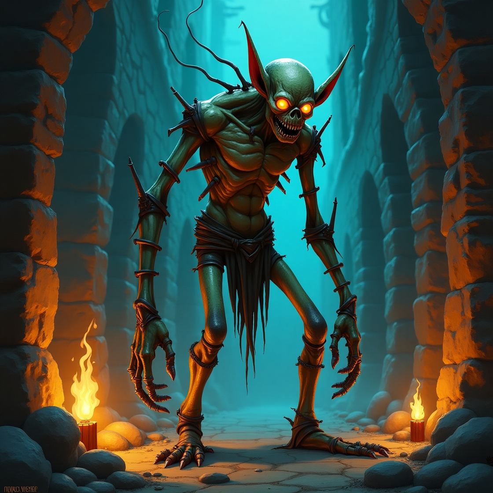

# Rust RPG Battle Simulator ⚔️

A simple, text-based RPG battle game written in Rust. This project was created as a learning exercise to practice the core concepts of the Rust programming language.

## ✨ Features

- **Turn-Based Combat:** A classic battle system where the player and the enemy take turns attacking each other.
- **Character Selection:** Choose from several predefined heroes, each with unique, randomly generated stats.
- **Dynamic Damage Calculation:** The combat logic considers both attack power and defense to determine the outcome of each hit.
- **Interactive CLI:** A fully interactive command-line interface to guide the player through the game.

## 🚀 How to Run

1.  **Clone the repository:**
    ```bash
    git clone https://github.com/n0secutiry/simple-console-rpg
    cd simple-console-rpg
    ```

2.  **Run the project:**
    Use Cargo to build and run the project in release mode for the best performance.
    ```bash
    cargo run --release
    ```

## 🎮 Gameplay

The game starts by asking for your name and then offers a choice of heroes. After selecting a hero, you will face a randomly generated monster. The first attacker is chosen randomly, and the battle continues until one character's health drops to zero.

 

## 🛠️ Technologies Used

- [Rust](https://www.rust-lang.org/)
- Crates:
  - `rand` for random number generation.
  - `colored` for styling console output.
